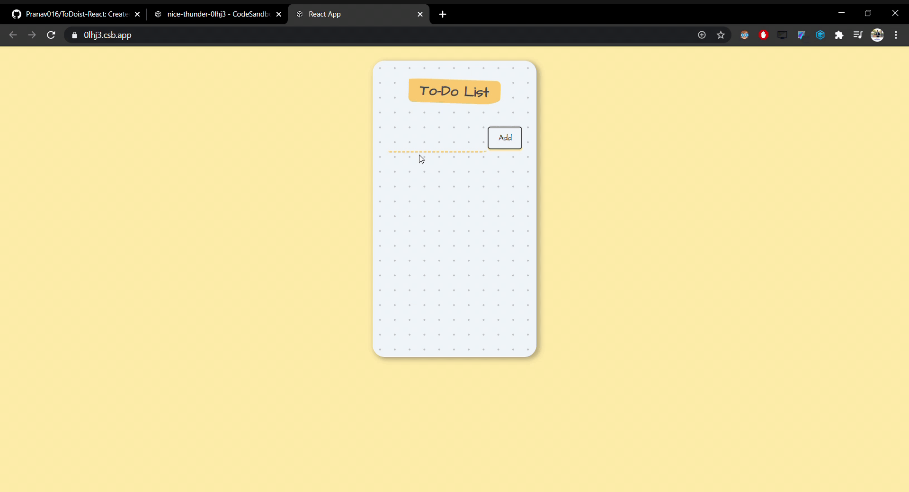

# ToDoist-React
This is a ToDo list app to keep track of your daily tasks and mark as done on completion.
Created with CodeSandbox

## Tech Stack-
- HTML
- CSS
- React Js

## Demo-


## Environment Setup-

* Drop a :star: on the GitHub repository.
<br/>

* This project was developed using CodeSandbox. [Checkout or Fork the CodeSandbox](codesandbox.io/s/nice-thunder-0lhj3)

#### To setup local environment to use the project, follow steps:

* Download and install a code/ text editor.
    - Recommended-
        - [Download VS Code](https://code.visualstudio.com/download)
        - [Download Atom](https://atom.io/)
<br/>

* Download [Node Js and npm(Node package manager)](https://nodejs.org/en/) (when you download Node, npm also gets installed by default)
<br/>

* Clone the repository by running command
```
git clone https://github.com/Pranav016/ToDoist-React.git
```
in your git bash.
<br/>

* Run command `cd ToDoist-React`.
<br/>

* Run this command to install all dependencies for the project.
```
npm install
```
<br/>

* Run this command to start the project on local host 3000.
```
node src/index.js
```
<br/>

* Now you are all set to use this project.
